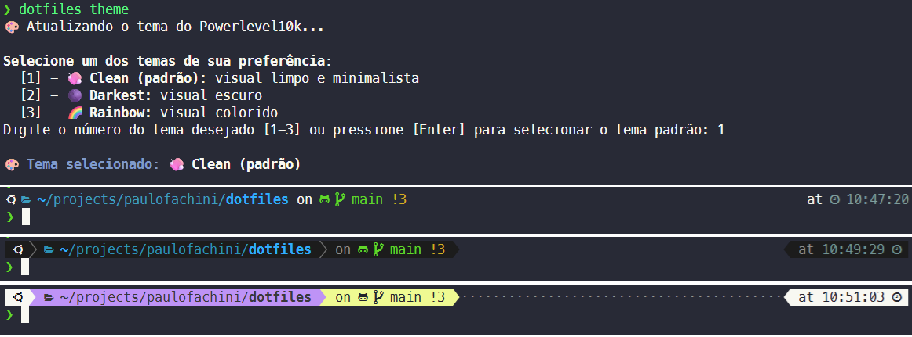
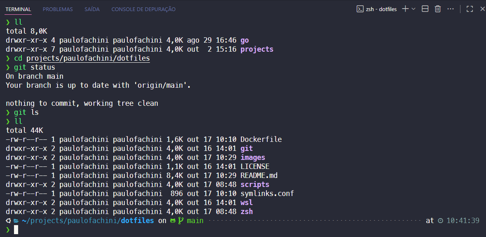

> [PT-BR] Versão em português: [README.md](./README.md)


# 🧰 `.dotfiles` Repository

**This repository contains my configuration files (dotfiles) for the `WSL/Ubuntu` development environment, using `zsh`, `Oh My Zsh`, and `Powerlevel10k`.**

The goal is to have a productive, beautiful, and easily replicable environment with a single command.

## ✨ Features

- **Automated Installation**: One command to set up the entire environment.
- **Powerlevel10k Theme**: Highly customizable, with interactive theme selection and excellent performance.
- **Essential Plugins**: `zsh-autosuggestions` and `zsh-syntax-highlighting` installed automatically.
- **Modular Structure**: Separate configurations for `aliases`, `functions`, `path`, and `languages`.
- **Easy Updates**: `dotfiles_update` command to sync your settings with the repository.
- **Local Configurations**: Support for a `.zshrc.local` file for your private, unversioned settings.
- **Main Commands**: Functions like `dotfiles_help`, `dotfiles_update`, `dotfiles_theme`, and `dotfiles_reload` to make maintenance and customization easier.
- **Automated Testing via Docker**: Environment validation in a container to ensure everything works in a clean setup.
- **Full Compatibility**: Optimized for WSL/Ubuntu and Windows Terminal.

---

## 🚀 Installation

### 📌 Prerequisites

Before you start, make sure you have:

- **Windows Terminal**: Recommended for the best experience, see the [Installation Guide](https://github.com/microsoft/terminal).
  Or run the command below in PowerShell or Command Prompt:

  ```shell
  winget install --id Microsoft.WindowsTerminal -e
  ```

- **Nerd Font**: Install the **[MesloLGS NF](https://github.com/romkatv/powerlevel10k?tab=readme-ov-file#meslo-nerd-font-patched-for-powerlevel10k)** font and **set it as default** in your Windows Terminal.
- **Windows Subsystem for Linux (WSL)**: [Installation Guide](https://learn.microsoft.com/en-us/windows/wsl/install).

### ⚡️ One-Command Installation

To set up a new environment, paste the command below into your Ubuntu terminal in WSL. It will take care of everything for you.

```bash
bash -c "$(curl -fsSL https://raw.githubusercontent.com/paulofachini/.dotfiles/main/scripts/install.sh)"
```

The installation script will:

- Install essential dependencies (`git`, `zsh`, `curl`, etc.).
- Set the `locale` to `pt_BR.UTF-8`.
- Install Oh My Zsh and set it as your default shell.
- Clone the `zsh-autosuggestions` and `zsh-syntax-highlighting` plugins.
- Clone this repository to `~/.dotfiles`.
- Create the necessary symbolic links (symlinks) for the configurations.

At the end, **restart your terminal** so all changes take effect.

---

## 🖥️ Main Commands

After installation, you can use handy commands to manage and customize your environment:

| Command           | What it does                                                                           |
| ----------------- | -------------------------------------------------------------------------------------- |
| `dotfiles_help`   | Shows a list of useful commands and help for the `.dotfiles`.                          |
| `dotfiles_update` | Updates the `.dotfiles` repository, applies the latest configs, and restores symlinks. |
| `dotfiles_theme`  | Opens the interactive Powerlevel10k theme selector to customize your terminal's look.  |
| `dotfiles_reload` | Reloads Zsh, applying changes made to config files immediately.                        |

These commands are available automatically after installation and make it easy to maintain and personalize your environment.

---

## 🔄 Updating Configurations

To keep your settings up to date with the latest changes from the repository, just run:

```shell
dotfiles_update
```

This command (an alias for the `dotupdate()` function) will automatically pull updates, recreate symlinks, and reload your shell.

---

## 🎨 Theme Customization

### 🖌️ Selecting a Predefined Theme

To choose one of the predefined `.dotfiles` themes, run:

```shell
dotfiles_theme
```

This command will open an interactive selector where you can choose from the available themes:

- **🧼 Clean**: Clean and minimal look.
- **🌑 Darkest**: Dark theme.
- **🌈 Rainbow**: Colorful theme.

After selecting a theme, the script will generate the required `.p10k.zsh` file with the corresponding settings.

### ✏️ Creating Your Own Powerlevel10k Theme

If you don't want any of the available themes, you can create your own.
To do this, use the Powerlevel10k command by running in the terminal:

```shell
p10k configure
```

---

## 🛠️ Customizing Configurations

The modular structure makes customization easy. You can edit the following files:

- **`zsh/aliases.zsh`**: Add your own command line shortcuts.
- **`zsh/functions.zsh`**: Create more complex shell functions.
- **`zsh/path.zsh`**: Modify `$PATH` and other environment variables.
- **`zsh/languages.zsh`**: Configure tools for your programming languages.
- **`.zshrc.local`**: Create this file in your `$HOME` to add **private** settings that shouldn't go into the repository (like API keys).
- **`symlinks.conf`**: Manifest file that defines which repository files should be linked to your `$HOME`.

### 🔗 Managing Symlinks with `symlinks.conf`

**File format:**

Each line represents a symlink and follows the format:

```text
# Format: <repo_file> <home_destination>
zsh/.zshrc      .zshrc
zsh/.p10k.zsh   .p10k.zsh
git/.gitconfig  .gitconfig
```

You can add other files following this pattern. Comments (lines starting with `#`) are allowed.

**Practical Example: Adding your `.gitconfig`**

1. **Create the file** inside your repository. For example, you can create a `git` folder and put your config file there: `~/.dotfiles/git/.gitconfig`.
2. **Add the entry** in `symlinks.conf`:

   ```text
   zsh/.zshrc .zshrc
   zsh/.p10k.zsh .p10k.zsh
   git/.gitconfig .gitconfig
   ```

3. **Run the update**:

   ```shell
   dotfiles_update
   ```

   The script will automatically create the symlink from `~/.gitconfig` to `~/.dotfiles/git/.gitconfig`.

4. **Reload the configurations**:

```shell
dotfiles_reload
```

---

## 🧪 Testing with Docker

To ensure the installation scripts work correctly in a clean, isolated environment, you can use the included `Dockerfile`. The system automatically runs the full installation and validates that everything works.

**What is validated:**

- ✅ **Symlinks**: Checks if all dotfiles are correctly linked to the `$HOME` directory
- ✅ **Zsh loading**: Tests if the Zsh shell can load all configs without errors
- ✅ **Plugins installed**: Confirms that the `zsh-autosuggestions` and `zsh-syntax-highlighting` plugins are present

- **Build the Docker image:**
  In the project root, run the command to create the test image.

  ```shell
  docker build -t dotfiles-test .
  ```

- **Run automated tests:**
  This command overrides the default CMD and runs only the installation and automated validation, exiting after the tests:

  ```shell
  docker run --rm dotfiles-test /bin/bash -c "chmod +x .dotfiles/scripts/install.sh .dotfiles/scripts/test.sh && .dotfiles/scripts/install.sh && .dotfiles/scripts/test.sh"
  ```

- **Interactive test (optional):**
  This command uses the container's default CMD, which runs installation, tests, AND opens an interactive Zsh shell for manual exploration:

  ```shell
  docker run -it --rm dotfiles-test
  ```

---

## 📂 Project Structure

```text
.dotfiles/
├── git/
│   └── .gitconfig               → Git settings (e.g., username, email, aliases).
├── scripts
│   ├── banner.sh                → Shows a custom welcome message.
│   ├── install.sh               → Main installation script.
│   ├── restore.sh               → Script to restore and create symlinks in the `$HOME` directory.
│   ├── select-theme.sh          → Script to select the Powerlevel10k theme.
│   └── test.sh                  → Automated tests to validate installation.
├── wsl/
│   ├── .wslconfig_desktop       → WSL Desktop settings (e.g., default distro, resources).
│   └── .wslconfig_note          → WSL Notebook settings (e.g., default distro, resources).
├── zsh
│   ├── .p10k-clean.zsh          → Powerlevel10k theme config (clean look).    # Used by `select-theme.sh` to create `.p10k.zsh`
│   ├── .p10k-darkest.zsh        → Powerlevel10k theme config (dark look).     # Used by `select-theme.sh` to create `.p10k.zsh`
│   ├── .p10k-rainbow.zsh        → Powerlevel10k theme config (colorful look). # Used by `select-theme.sh` to create `.p10k.zsh`
│   ├── .zshrc                   → Entry point that loads all other modules.
│   ├── aliases.zsh              → Aliases for Git, Docker, Node/NPM.
│   ├── functions.zsh            → Custom functions (like `dotupdate`).
│   ├── languages.zsh            → Node/NVM, Python/pyenv, Go.
│   ├── path.zsh                 → Environment variables and PATH.
│   ├── plugins.zsh              → Oh My Zsh + external plugins.
│   ├── setup.zsh                → Powerlevel10k, history, and autocompletion settings.
│   └── theme.zsh                → Defines and loads the Powerlevel10k theme.
├── Dockerfile                   → Dockerfile for automated tests.
├── symlinks.conf                → Defines the symlinks to be created.
├── README.en.md                 → This file in English
└── README.md                    → This file in Portuguese
```

## 🖼️ Images

### Themes (🧼 Clean / 🌑 Darkest / 🌈 Rainbow)



### Update


### VS Code Terminal



### Windows Terminal


## ©️ License

This repository is for personal use, but feel free to take inspiration from it.
It is licensed under the MIT license. See the [LICENSE](./LICENSE) file for more details.
