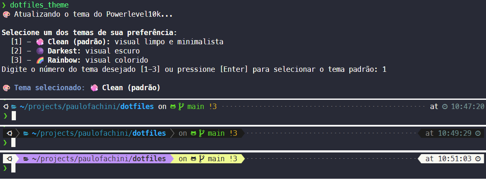
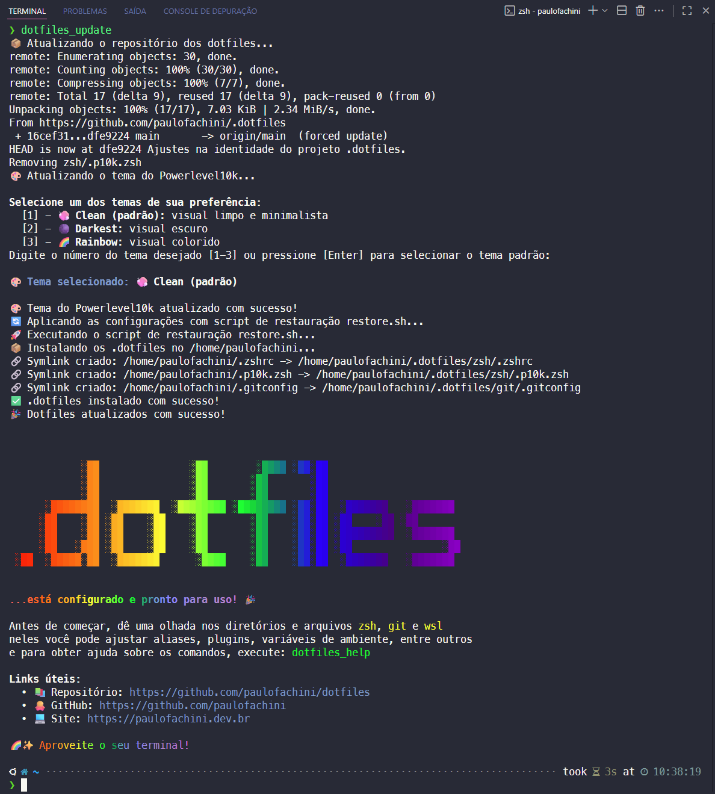
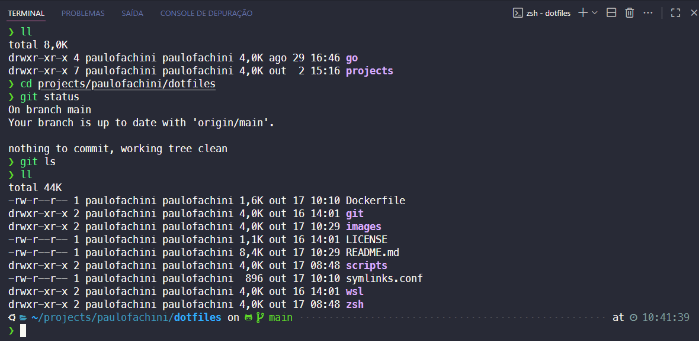
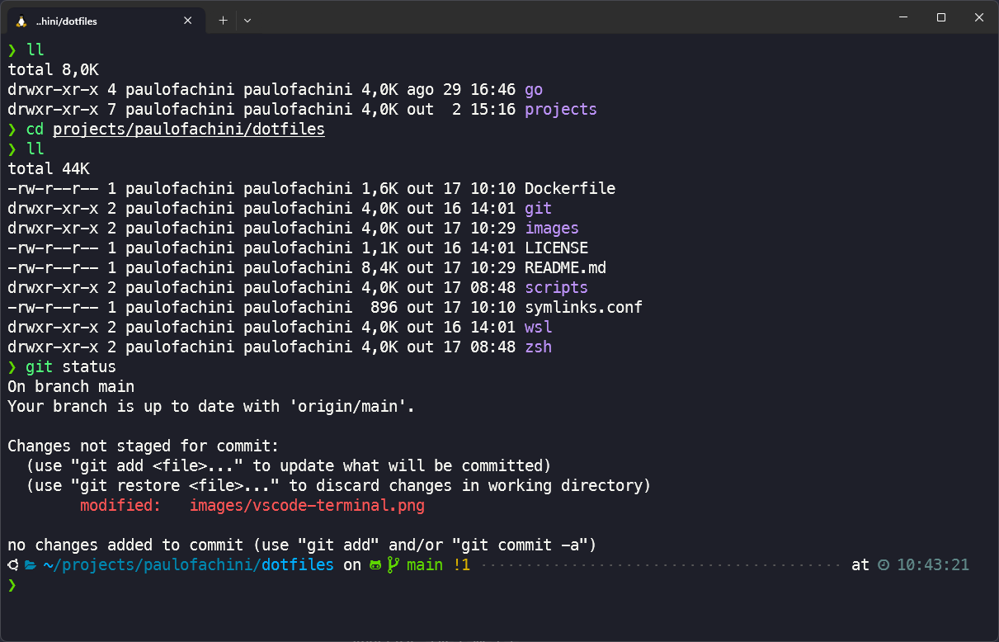

# 🧰 Repositório de `.dotfiles`

**Este repositório contém meus arquivos de configuração (dotfiles) para o ambiente de desenvolvimento `WSL/Ubuntu`, utilizando `zsh`, `Oh My Zsh` e `Powerlevel10k`.**

O objetivo é ter um ambiente produtivo, bonito e facilmente replicável com um único comando.

## ✨ Características

- **Instalação Automatizada**: Um único comando para configurar todo o ambiente.
- **Tema Powerlevel10k**: Altamente customizável, com seleção interativa de temas e excelente performance.
- **Plugins Essenciais**: `zsh-autosuggestions` e `zsh-syntax-highlighting` instalados automaticamente.
- **Estrutura Modular**: Configurações separadas para `aliases`, `funções`, `path` e `linguagens`.
- **Atualizações Fáceis**: Comando `dotfiles_update` para sincronizar suas configurações com o repositório.
- **Configurações Locais**: Suporte para um arquivo `.zshrc.local` para suas configurações privadas e não versionadas.
- **Comandos Principais**: Funções como `dotfiles_help`, `dotfiles_update`, `dotfiles_theme` e `dotfiles_reload` para facilitar manutenção e personalização.
- **Testes Automatizados via Docker**: Validação do ambiente em container para garantir funcionamento em ambiente limpo.
- **Compatibilidade Total**: Otimizado para WSL/Ubuntu e Windows Terminal.

---

## 🚀 Instalação

### 📌 Pré-requisitos

Antes de começar, garanta que você tenha:

- **Windows Terminal**: Recomendado para a melhor experiência, acesse [Guia de Instalação](https://github.com/microsoft/terminal).
  Ou execute o comando abaixo no PowerShell ou Prompt de Comando:

  ```shell
  winget install --id Microsoft.WindowsTerminal -e
  ```

- **Fonte Nerd Font**: Instale a fonte **[MesloLGS NF](https://github.com/romkatv/powerlevel10k?tab=readme-ov-file#meslo-nerd-font-patched-for-powerlevel10k)** e **configure-a como padrão** no seu Windows Terminal.
- **Windows Subsystem for Linux (WSL)**: [Guia de Instalação](https://learn.microsoft.com/pt-br/windows/wsl/install).

### ⚡️ Instalação com Um Comando

Para configurar um novo ambiente, cole o comando abaixo no seu terminal Ubuntu no WSL. Ele cuidará de tudo para você.

```bash
bash -c "$(curl -fsSL https://raw.githubusercontent.com/paulofachini/.dotfiles/main/scripts/install.sh)"
```

O script de instalação fará o seguinte:

- Instalará dependências essenciais (`git`, `zsh`, `curl`, etc.).
- Configurará o `locale` para `pt_BR.UTF-8`.
- Instalará o Oh My Zsh e o definirá como seu shell padrão.
- Clonará os plugins `zsh-autosuggestions` e `zsh-syntax-highlighting`.
- Clonará este repositório para `~/.dotfiles`.
- Criará os links simbólicos (`symlinks`) necessários para as configurações.

Ao final, **reinicie seu terminal** para que todas as mudanças tenham efeito.

---

## 🖥️ Comandos Principais

Após a instalação, você pode utilizar comandos práticos para gerenciar e personalizar seu ambiente:

| Comando           | O que faz                                                                                    | Exemplo de uso    |
| ----------------- | -------------------------------------------------------------------------------------------- | ----------------- |
| `dotfiles_help`   | Exibe uma lista de comandos úteis e ajuda dos `.dotfiles`.                                   | `dotfiles_help`   |
| `dotfiles_update` | Atualiza o repositório dos `.dotfiles`, aplica as últimas configurações e restaura symlinks. | `dotfiles_update` |
| `dotfiles_theme`  | Abre o seletor interativo de tema Powerlevel10k para personalizar o visual do terminal.      | `dotfiles_theme`  |
| `dotfiles_reload` | Recarrega o Zsh aplicando imediatamente as alterações feitas nos arquivos de configuração.   | `dotfiles_reload` |

Esses comandos estão disponíveis automaticamente após a instalação e facilitam a manutenção e personalização do seu ambiente.

---

## 🔄 Atualizando as Configurações

Para manter suas configurações atualizadas com as últimas mudanças do repositório, basta executar o comando:

```shell
dotfiles_update
```

Este comando (um alias para a função `dotupdate()`) irá automaticamente baixar as novidades, recriar os symlinks e recarregar seu shell.

---

## 🎨 Personalização de Temas

### 🖌️ Selecionando um dos Temas pré-definidos

Para escolher um dos temas pré-definidos do `.dotfiles`, execute o seguinte comando:

```shell
dotfiles_theme
```

Este comando abrirá um seletor interativo onde você poderá escolher entre os temas disponíveis:

- **🧼 Clean**: Visual limpo e minimalista.
- **🌑 Darkest**: Tema escuro.
- **🌈 Rainbow**: Tema colorido.

Após selecionar o tema, o script irá gerar o arquivo `.p10k.zsh` necessário com as configurações correspondentes.

### ✏️ Criando o seu próprio tema com o Powerlevel10k

Caso você não queira nenhum dos temas disponíveis, você pode criar o seu próprio tema.
Para isso utilize o comando do próprio Powerlevel10k, executando no terminal:

```shell
p10k configure
```

---

## 🛠️ Personalização das Configurações

A estrutura modular facilita a personalização. Você pode editar os seguintes arquivos:

- **`zsh/aliases.zsh`**: Adicione seus próprios atalhos de linha de comando.
- **`zsh/functions.zsh`**: Crie funções de shell mais complexas.
- **`zsh/path.zsh`**: Modifique o `$PATH` e outras variáveis de ambiente.
- **`zsh/languages.zsh`**: Configure as ferramentas para suas linguagens de programação.
- **`.zshrc.local`**: Crie este arquivo no seu `$HOME` para adicionar configurações **privadas** que não devem ir para o repositório (como chaves de API).
- **`symlinks.conf`**: Arquivo de manifesto que define quais arquivos do repositório devem ser linkados para o seu `$HOME`.

### 🔗 Gerenciando Links Simbólicos com `symlinks.conf`

**Formato do arquivo:**

Cada linha representa um link simbólico e segue o formato:

```text
# Formato: <arquivo_no_repo> <destino_no_home>
zsh/.zshrc      .zshrc
zsh/.p10k.zsh   .p10k.zsh
git/.gitconfig  .gitconfig
```

Você pode adicionar outros arquivos seguindo esse padrão. Comentários (linhas iniciadas com `#`) são permitidos.

**Exemplo Prático: Adicionando seu `.gitconfig`**

1. **Crie o arquivo** dentro do seu repositório. Por exemplo, você pode criar uma pasta `git` e colocar seu arquivo de configuração lá: `~/.dotfiles/git/.gitconfig`.
2. **Adicione a entrada** no `symlinks.conf`:

   ```text
   zsh/.zshrc .zshrc
   zsh/.p10k.zsh .p10k.zsh
   git/.gitconfig .gitconfig
   ```

3. **Execute a atualização**:

   ```shell
   dotfiles_update
   ```

   O script irá criar automaticamente o link simbólico de `~/.gitconfig` para `~/.dotfiles/git/.gitconfig`.

4. **Execute o comando para recarregar as configurações**:

```shell
dotfiles_reload
```

---

## 🧪 Testando com Docker

Para garantir que os scripts de instalação funcionem corretamente em um ambiente limpo e isolado, você pode usar o `Dockerfile` incluído no projeto. O sistema executa automaticamente a instalação completa e valida se tudo está funcionando.

**O que é validado:**

- ✅ **Links simbólicos**: Verifica se todos os .dotfiles estão corretamente linkados para o diretório `$HOME`
- ✅ **Carregamento do Zsh**: Testa se o shell Zsh consegue carregar todas as configurações sem erros
- ✅ **Plugins instalados**: Confirma que os plugins `zsh-autosuggestions` e `zsh-syntax-highlighting` estão presentes

- **Construa a imagem Docker:**
  Na raiz do projeto, execute o comando para criar a imagem de teste.

  ```shell
  docker build -t dotfiles-test .
  ```

- **Execute os testes automatizados:**
  Este comando sobrescreve o CMD padrão e executa apenas a instalação e validação automatizada, saindo após os testes:

  ```shell
  docker run --rm dotfiles-test /bin/bash -c "chmod +x .dotfiles/scripts/install.sh .dotfiles/scripts/test.sh && .dotfiles/scripts/install.sh && .dotfiles/scripts/test.sh"
  ```

- **Teste interativo (opcional):**
  Este comando usa o CMD padrão do container, que executa instalação, testes E abre um shell Zsh interativo para exploração manual:

  ```shell
  docker run -it --rm dotfiles-test
  ```

---

## 📂 Estrutura do Projeto

```text
.dotfiles/
├── git/
│   └── .gitconfig               → Configurações do Git (ex: nome de usuário, e-mail, aliases).
├── scripts
│   ├── banner.sh                → Exibe uma mensagem de boas-vindas personalizada.
│   ├── install.sh               → Script principal de instalação.
│   ├── restore.sh               → Script para restaurar e criar os symlinks no diretório `$HOME`.
│   ├── select-theme.sh          → Script para selecionar o tema do Powerlevel10k.
│   └── test.sh                  → Testes automatizados para validar a instalação.
├── wsl/
│   ├── .wslconfig_desktop       → Configurações do WSL do Desktop (ex: distribuição padrão, recursos).
│   └── .wslconfig_note          → Configurações do WSL do Notebook (ex: distribuição padrão, recursos).
├── zsh
│   ├── .p10k-clean.zsh          → Configuração do tema Powerlevel10k (visual limpo).    # Usado pelo `select-theme.sh` para criar o arquivo `.p10k.zsh`
│   ├── .p10k-darkest.zsh        → Configuração do tema Powerlevel10k (visual escuro).   # Usado pelo `select-theme.sh` para criar o arquivo `.p10k.zsh`
│   ├── .p10k-rainbow.zsh        → Configuração do tema Powerlevel10k (visual colorido). # Usado pelo `select-theme.sh` para criar o arquivo `.p10k.zsh`
│   ├── .zshrc                   → Ponto de entrada que carrega todos os outros módulos.
│   ├── aliases.zsh              → Aliases para Git, Docker, Node/NPM.
│   ├── functions.zsh            → Funções customizadas (como `dotupdate`).
│   ├── languages.zsh            → Node/NVM, Python/pyenv, Go.
│   ├── path.zsh                 → Variáveis de ambiente e PATH.
│   ├── plugins.zsh              → Oh My Zsh + plugins externos.
│   ├── setup.zsh                → Configurações do Powerlevel10k, histórico e autocompletion.
│   └── theme.zsh                → Defini e carrega o tema Powerlevel10k.
├── Dockerfile                   → Dockerfile criado para realizar os testes automatizados.
├── symlinks.conf                → Define os symlinks a serem criados.
├── LICENSE                      → Licença do projeto
└── README.md                    → Este arquivo
```

## 🖼️ Imagens

### Temas (🧼 Clean / 🌑 Darkest / 🌈 Rainbow)



### Atualização



### VS Code Terminal



### Windows Terminal



## ©️ Licença

Este repositório é de uso pessoal, mas sinta-se à vontade para se inspirar.
Ele está licenciado sob a licença MIT. Veja o arquivo [LICENSE](./LICENSE) para mais detalhes.
